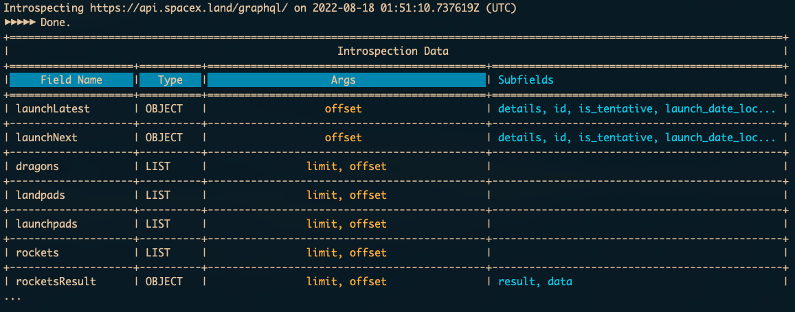

# Attercop

[](http://unmaintained.tech/)

Attercop is an experimental Elixir-based GraphQL penetration testing and attack surface discovery tool that scans and identifies public GraphQL endpoints.

Inspiration for architecture and use was drawn from other tools such as [Nmap](https://nmap.org/) and [Metasploit](https://www.metasploit.com/).

## Screenshots


##### Search for a specific argument


## Features:
- [x] Introspect a GraphQL API and display field information to the end user
- [x] Search through introspection data to identify arguments that can potentially be used in an attack
- [ ] Generate modules allowing for automatic IDOR detection (WIP)
- [ ] Execution of suites of modules, with analysis of the results and a confidence score (WIP)
- [ ] Authentication layer
- [ ] Module generator
- [ ] Interface existing analysis module with module configs
- [ ] Installable executable through package manager

## Building the script
- Clone this repository
- run `mix escript.build`

## Running the script
Once the script is built as a local binary, you can run it by calling it directly:
```
$ ./attercop introspect https://api.spacex.land/graphql/
...
# ./attercop recon https://api.spacex.land/graphql/ 'id'
...
```

## General Usage
```
usage: attercop [--verbose] [--no-truncate] <command> [<args>]

Commands
   recon        Lists potential pivot arguments
   introspect   Fetch and display the GraphQL schema
```

## Contributors
- [Alex Larsen](https://github.com/alex0112)
- [Holden Oullette](https://github.com/houllette)

Attercop was developed as a tool by the Podium Security Team.
